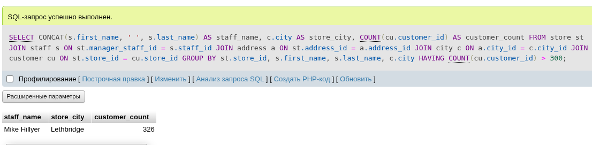
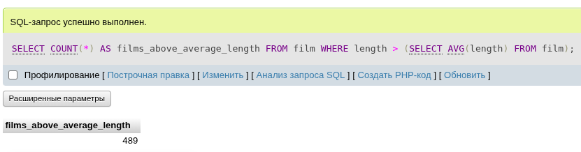
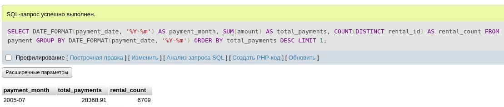

# Домашнее задание к занятию «SQL. Часть 2» - Малявко Сергей (netology)

Задание можно выполнить как в любом IDE, так и в командной строке.

### Задание 1
Одним запросом получите информацию о магазине, в котором обслуживается более 300 покупателей, и выведите в результат следующую информацию:
- фамилия и имя сотрудника из этого магазина;
- город нахождения магазина;
- количество пользователей, закреплённых в этом магазине.

### Выполнение задания 1
```sql
SELECT 
    CONCAT(s.first_name, ' ', s.last_name) AS staff_name,
    c.city AS store_city,
    COUNT(cu.customer_id) AS customer_count
FROM 
    store st
JOIN 
    staff s ON st.manager_staff_id = s.staff_id
JOIN 
    address a ON st.address_id = a.address_id
JOIN 
    city c ON a.city_id = c.city_id
JOIN 
    customer cu ON st.store_id = cu.store_id
GROUP BY 
    st.store_id, s.first_name, s.last_name, c.city
HAVING 
    COUNT(cu.customer_id) > 300;
```
##### Скриншот выполнения команды


### Задание 2
Получите количество фильмов, продолжительность которых больше средней продолжительности всех фильмов.

### Выполнение задания 2
```sql
SELECT COUNT(*) AS films_above_average_length
FROM film
WHERE length > (SELECT AVG(length) FROM film);
```
##### Скриншот выполнения команды


### Задание 3
Получите информацию, за какой месяц была получена наибольшая сумма платежей, и добавьте информацию по количеству аренд за этот месяц.

### Выполнение задания 3
```sql
SELECT 
    DATE_FORMAT(payment_date, '%Y-%m') AS payment_month,
    SUM(amount) AS total_payments,
    COUNT(DISTINCT rental_id) AS rental_count
FROM 
    payment
GROUP BY 
    DATE_FORMAT(payment_date, '%Y-%m')
ORDER BY 
    total_payments DESC
LIMIT 1;
```
##### Скриншот выполнения команды


